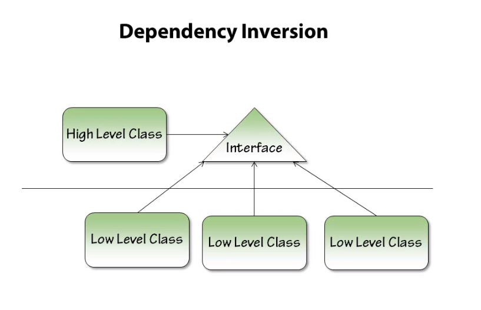

# Dependency Inversion Principle  (ISP)

<p align="center">
  
</p>

```High-level modules should not depend on low-level modules. Both should depend on abstractions. Abstractions should not depend on details. Details should depend on abstractions.```


```High-level modules should not depend on low-level modules```. Both should depend on abstractions: This is suggesting that the high-level modules ( modules that implement business logic or use cases) should not directly depend on or interact with the low-level modules (modules that perform basic, low-level functions like writing to a database or handling HTTP requests). Both should interact through abstractions (like interfaces or abstract classes).    

```Abstractions should not depend on details```. Details should depend on abstractions: This means the abstraction does not know about the underlying implementation. It's the responsibility of the underlying detail (i.e., the classes implementing the interface) to adhere to the contract defined by the abstraction.   