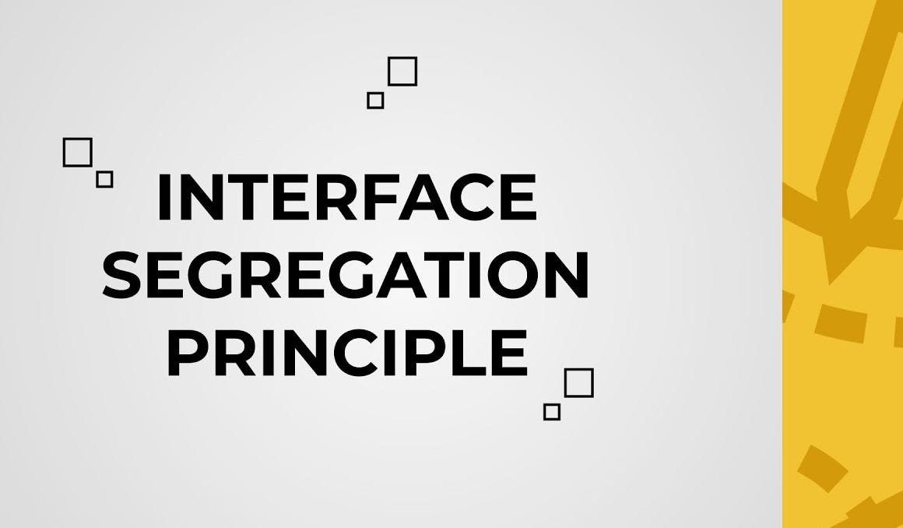

# Interface Segregation Principle  (ISP)

  

ISP advises the creation of smaller, more focused interfaces rather than one large, general-purpose interface. Each interface should contain only the methods that are relevant to a specific client or set of clients. This helps in minimizing the dependency of a class on methods it doesn't use, leading to a more decoupled and modular design.

The Interface Segregation Principle helps in creating more modular, maintainable, and flexible code by encouraging the use of smaller, client-specific interfaces. It reduces the impact of changes and avoids forcing classes to depend on methods they do not need.