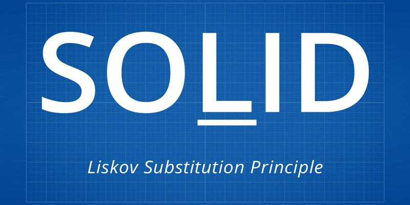

# Interface Segregation Principle  (ISP)

  

If S is a subtype of T, then objects of type T in a program may be replaced with objects of type S without altering any of the desirable properties of that program.

## Explanation  

### Subtyping (S is a subtype of T):

In object-oriented programming, a subtype S of type T means that S inherits from T or implements T (in the case of interfaces).
Essentially, S should be a more specific version of T.

### Objects of type T:

These are instances of the class T or any of its supertypes.
In a program, you might have variables, parameters, or return types that are declared to be of type T.

### May be replaced with objects of type S:

This means that anywhere you use an object of type T, you should be able to use an object of type S instead.

### Without altering any of the desirable properties of that program:

The program should continue to function correctly without any changes in its behavior.
This implies that S must meet the expectations set by T's contract, including method behavior, performance characteristics, and any invariants or preconditions.

the principle states that objects of a superclass should be replaceable with objects of a subclass without affecting the correctness of the program.    

In simpler terms, if you have a base class and a derived class, you should be able to replace the base class with the derived class without altering the behavior or the expected outcomes of the program. This ensures that a subclass can stand in for its superclass and behave in the same way.