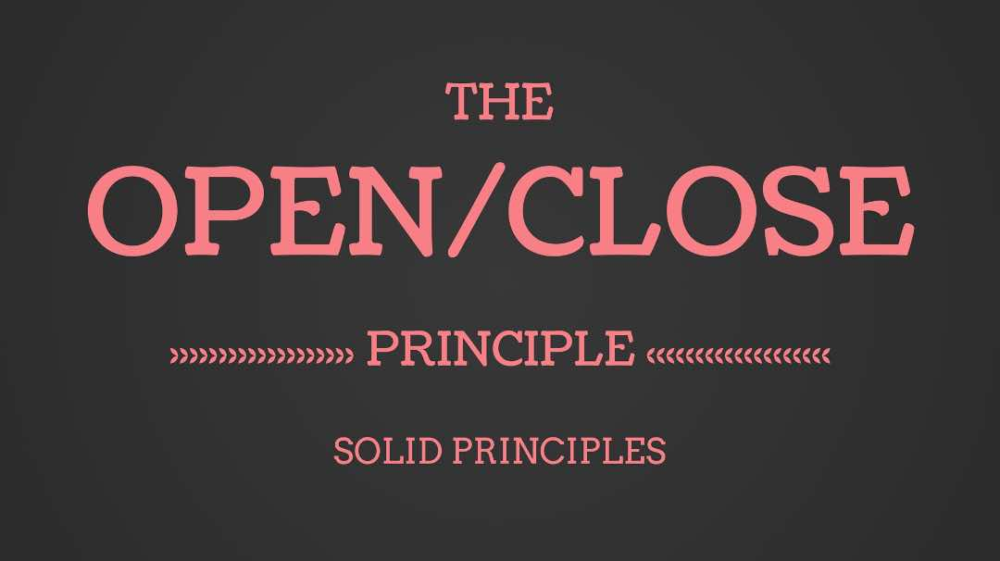

# Open-Closed Principle (OCP)

  

This principle dictates that software entities (classes, modules, functions, etc.) should be open for extension but closed for modification. This means that you should be able to add new features or functionality to a system without altering its existing code. You can extend the behavior of the object, but you should not modify its source code.

The Open-Closed Principle states that "software entities (classes, modules, functions, etc.) should be open for extension, but closed for modification." It's one of the five design principles of SOLID, a popular set of guidelines for object-oriented programming, and was introduced by Bertrand Meyer in 1988.

### Detailed Explanation:

**Open for extension**: This means that the behavior of the software entity can be extended, that is, we should be able to add new features or behavior to it.

**Closed for modification**: This means that once the software entity is developed and it has been reviewed and tested, the code should not be touched (to correct the software behavior).